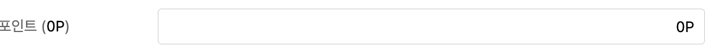

# 📝 2023년 11월 26일 기록

## 공통의 저주

---------

> dry 원칙이라며 반복되는 UI는 **공통** 으로 분리해야 한다는 끔찍한 저주

공통 Input component 가 있다고 상상해보자.
```typescript jsx
// 공통 input

type InputProps = InputHTMLAttributes<HTMLInputElement>;

export const Input = ({ type, ...props }: InputProps) => {
  const [input, setInput] = useState('');

  const handleChangeInput = (e: React.ChangeEvent<HTMLInputElement>) => {
    setInput(e.target.value);
  };

  return <input {...props} type={type} onChange={handleChangeInput} value={input} />;
};
```

### 요구사항 1. 회원가입을 할 때만 validation 을 달아주고 싶어요.
🤔: 회원가입인 경우에만 valid 할 때 스타일을 추가하면 되지 않을까 ?

```typescript jsx
type InputProps = {
  inputType: 'signup' | 'signin';
  isValid?: boolean;
} & InputHTMLAttributes<HTMLInputElement>;

export const Input = ({ type, inputType, isValid, ...props }: InputProps) => {
  const [input, setInput] = useState('');

  const handleChangeInput = (e: React.ChangeEvent<HTMLInputElement>) => {
    setInput(e.target.value);
  };

  return (
    <>
      <input {...props} type={type} onChange={handleChangeInput} value={input} />
      {inputType === 'signup' && isValid === false ? <div>유효하지 않습니다.</div> : null}
    </>
  );
};

```

> `inputType` , `isValid` 가 생겼다 !

### 요구사항 2. 포인트를 보여줘요 !


```typescript jsx
type InputProps = {
  inputType: 'signup' | 'signin' | 'point';
  isValid?: boolean;
  currentHasPoint: number;
} & InputHTMLAttributes<HTMLInputElement>;

export const Input = ({ type, inputType, isValid, ...props }: InputProps) => {
  const [input, setInput] = useState('');

  const handleChangeInput = (e: React.ChangeEvent<HTMLInputElement>) => {
    if(inputType === 'point') {
   		const validPointInput = Number(e.target.value.replace(/[^0-9]+/g, ''));

        if (validPointInput > currentHasPoint) {
          alert(`이용가능한 포인트는 ${currentHasPoint}입니다.`);
          setInput(currentHasPoint);
          return;
        }

        setInput(validPointInput);
        return;
    }
    
    setInput(e.target.value);
  };
  
  const inputFormat = inputType === 'point' ? `${input.toLocaleString()}P` : input;

  return (
    <>
      <input {...props} type={type} onChange={handleChangeInput} value={inputFormat} />
      {inputType === 'signup' && isValid === false ? <div>유효하지 않습니다.</div> : null}
    </>
  );
};
```

### 뭔가 이상해
공통 Input으로 로그인, 회원가입, 포인트 폼으로 활용했어요.
- GOOD: 공통 Input 하나만으로 여러 요구사항을 충족시켰어요
- BAD: 여러 요구사항을 한번에 처리하려보니, 공통 Input이 너무나 많은 기능을 하고 있어요.

### 정리하자면,
- 우리는 button, input 을 공통으로 많이 만드려고 해요.
- input을 공통으로 만드는게 좋다고 해서, 비슷한 ui들을 공통으로 맞추기 위해 억지로 공통 input 태그에 여러 기능이 덕지덕지 넣어지게 돼요.

### 해결방법
- UI를 기준으로 공통으로 묶으려는 것을 `도메인 (=== 관심사)` 으로 바라보면 됩니다.
- `로그인` input과 `포인트` input 2개의 도메인은 관심사가 달라요.
- 동일한 UI로 보이지만, 추후에 둘 중 하나에 기능이 추가될 수 있고 UI가 변할 수도 있어요.
- 그렇기 때문에 `LoginInput`, `PointInput` 과 같이 동일한 UI를 가지지만 다른 컴포넌트로 분리해주어야 합니다.
- 이러한 관점을 `Headless Component` 라고 합니다.

### Headless Component
- 기능을 가지지 않는 컴포넌트.
- Headless Component + custom hook 조합은 아래와 같아요.

`Input`
```typescript jsx
// 스타일이 적용되있다고 가정하겠습니다.

interface InputProps<T> extends InputHTMLAttributes<HTMLInputElement> {
  input: T
}

export const Input = <T,>({ type, input ...props }: InputProps<T>) => {
  return <input {...props} type={type} onChange={handleChangeInput} value={input} />;
};

```

`LoginInput`
```typescript jsx
export const useLoginInput = () => {
	const [input, setInput] = useState('');
	const isValid = input.length > 8;

    const handleChangeInput = (e: React.ChangeEvent<HTMLInputElement>) => {
        setInput(e.target.value);
    };
  
  	return {input, isValid, handleChangeInput};
}

export const LoginInput = () => {
  const {input, isValid, handleChangeInput} = useLoginInput();
  
  return (
  	<>
    	<Input input={input} onChange={handleChangeInput} type="text"/>
      	{!isValid ? <div>유효하지 않습니다.<div> : null}
    </>
  )
}
```

`PointInput`
```typescript jsx
export const usePointInput = () => {
	const [input, setInput] = useState('');

    const handleChangeInput = (e: React.ChangeEvent<HTMLInputElement>) => {
        const validPointInput = Number(e.target.value.replace(/[^0-9]+/g, ''));

        if (validPointInput > currentHasPoint) {
          alert(`이용가능한 포인트는 ${currentHasPoint}입니다.`);
          setInput(currentHasPoint);
          return;
        }

        setInput(validPointInput);
        return;
    };
  
  	const inputFormat = `${input.toLocaleString()}P`;
  
  	return {inputFormat, handleChangeInput};
}

export const PointInput = () => {
  const {inputFormat, handleChangeInput} = useLoginInput();
  
  return (
  	<>
    	<Input input={inputFormat} onChange={handleChangeInput} type="number" />
    </>
  )
}

```
