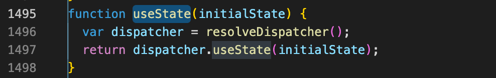
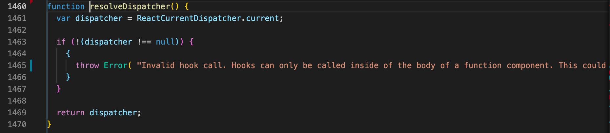
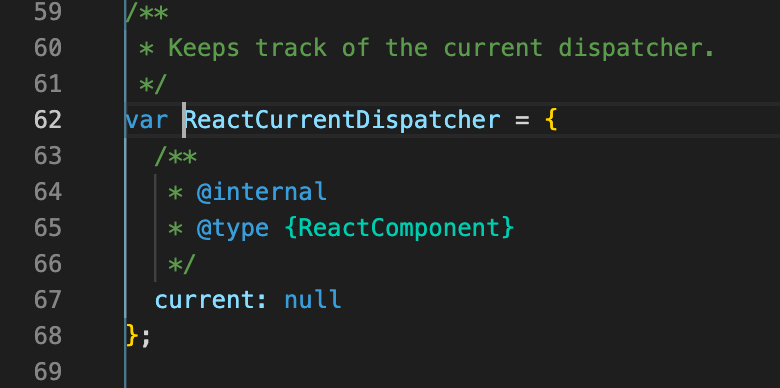

# 📝 2023년 11월 27일 기록

## 클로저가 React hook 과 무슨 관련이 있죠?

React useState

React 에서는 상태(status)가 변경되면 컴포넌트가 리렌더링이 일어나요.
- **React Hook**에서는 `useState`라는 Hook을 이용해 컴포넌트 내 상태를 관리해요.
- 아래와 같은 형태죠.
```typescript
const [state, setState] = useState(initialValue)
```

- 이 React Hook은 상태가 변경되었다는 것은 어떻게 알까요?
- 이때 바로 **클로저**를 사용해요.

useState를 했을 때 받아오는 값에 대해 거슬러 올라가보자.

`node_modules/react/cjs/react.development.js`

- `useState` 는 **InitialState** 를 인자로 받는 함수로 선언되어 있어요.
- 뭔진 모르지만, `resolveDispatcher` 를 이용해 **initialState**를 전달하고 있네요.

`resolveDispathcer`

- `resolveDispathcer` 를 한번 더 거슬러 올라가 보면요.
- `ReactCurrentDispatcher` 의 current 값을 리턴하고 있네요.

`ReactCurrentDispatcher`

- `ReactCurrentDispatcher` 은 그냥 `current` 값을 담은 변수네요?
- `ReactCurrentDispatcher` 은 전역에 선언된 객체라고 해요.

### 정리
- `useState` 를 우리가 사용하면
- 전역에서 선언된 객체의 값에 접근해 이전 값을 가져오고 관리하는 거네요. 

- 함수형 컴포넌트는 렌더가 필요할 때 함수를 다시 호출 해요.
- `렌더링 === 함수 호출`  이 되는 거에요.
- 함수형 컴포넌트에서 상태관리를 하기 위해선, 함수가 다시 호출되었을 때 이전 상태를 기억하고 있어야 하며, React Hooks는 이를 클로저를 통해 해결하려고 합니다.


## 그래서 클로저가 뭔데요.
함수가 선언될 그 당시에 주변의 환경과 함께 갇히는 것

```typescript jsx
function sayHello () {
  const a = 'Hello';
  const b = 'World';
  
  function sumString () {
    console.log(a + ' ' + b);
  }
  
  return sumString;
}

const myFunc = sayHello();

myFunc(); // 'Hello World'
```

```typescript
const fruits = ['apple', 'banana', 'peach'];
const ul = document.createElement('ul');

const fruitBuilder = function (fruit) {
  return function () {
    console.log('your choice is ' + fruit);
  }
}

fruits.forEach(function (fruit) {
  let li = document.createElement('li');
  li.innerText = fruit;
  li.addEventListener('click', fruitBuilder(fruit));
  ul.appendChild(li);
})

document.body.appendChild(ul);
```


**나쁜예** (`timer` 를 계속 생성함)
```typescript jsx
const debounce = (event) => {
    let timer;
    if (tiemr) clearTimeout(timer);
    timer = setTimeout(callback, delay, event);
    };
};
useEffect(() => {
    window.addEventListener('resize', debounce)
    return () => {
      window.removeEventListener('resize', debounce)
    }
},[])
```

**좋은 예 ** (`timer` 를 계속 생성함)
```typescript jsx
const debounce = () => {
    let timer;
    return event => {
      if (tiemr) clearTimeout(timer);
      timer = setTimeout(callback, delay, event);
    }
};
useEffect(() => {
  window.addEventListener('resize', debounce())
  return () => {
    window.removeEventListener('resize', debounce())
  }
},[])
```
