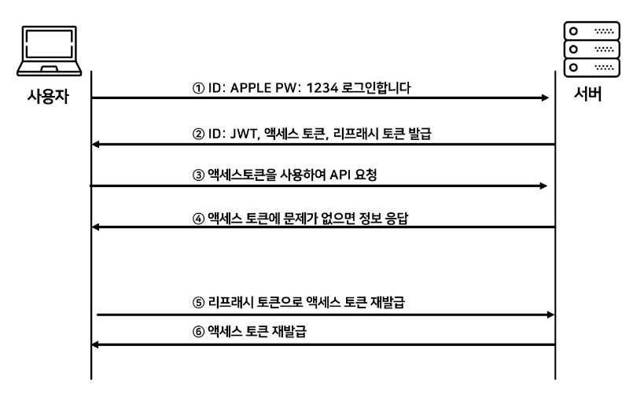

# 📝 2023년 11월 29일 기록

## 무엇을 테스트 해야 할까 ?

- 프론트엔드 테스팅에 접근할 땐 우선 **UI와 비즈니스 로직을 구분**해서 생각하는게 좋다.

### 비즈니스 로직
   - 함수나 클래스의 메서드에 어떤 인자로 어떤 값을 넘기면 어떤 값이 반환되는지 테스트
   - React에서 비지니스 로직은 보통 React 훅(hook)을 통해 컴포넌트로 부터 분리되어 있다.
   - 그럼 각 훅 함수에 대한 테스트 작성을 해보자.

### UI 테스트
- 각 컴포넌트가 최초에 랜더링이 될 때 브라우저 화면에 무엇이 나타나야 하는지를 테스트 
- 예를 들어, `상품 상세 정보를 보여주는 컴포넌트`라고 하면
     - 상품의 제목, 설명, 이미지, 가격 등등이 알맞은 HTML 요소 안에서 나타나는지를 테스트.
     - 그리고 사용자의 행위(마우스 클릭, 키보드 입력, 등등)에 반응하는 컴포넌트의 경우,
          - 해당 컴포넌트가 사용자와 예상한대로 상호작용하는지도 테스트
          - 예를 들어, 장바구니 컴포넌트라면 어떤 아이템을 상대로 수량 더하기나 빼기 버튼을 눌렀을 때, 변경된 수량에 따라서 합계 금액 부분이 다시 계산되어 랜더링이 되는지를 테스트

- React Testing Library 사용법: https://www.daleseo.com/react-testing-library/
- React Testing Library - 비동기 테스트: https://www.daleseo.com/react-testing-library-async/
- React Hooks Testing Library 사용법: https://www.daleseo.com/react-hooks-testing-library/
- 유저 이벤트 테스트 (@testing-library/user-event): https://www.daleseo.com/testing-library-user-agent/

**참고**
> https://careerly.co.kr/qnas/4421

----
## JWT
> `.` 을 구분자로 나누어지는 세가지 문자열의 조합

- Header: JWT에서 사용항 타입과 해시 알고리즘 종류
- Payload: 서버에서 첨부한 사용자 권한정보와 데이터
- Signature: Header에 명시된 해시함수를 적용하고, 개인키로 서명한 전자서명

### 인증과정

### Token
- Access Token : 클라이언트가 갖고있는 실제로 유저의 정보가 담긴 토큰으로, 클라이언트에서 요청이 오면 서버에서 해당 토큰에 있는 정보를 활용하여 사용자 정보에 맞게 응답을 진행
- Refresh Token: 새로운 Access Token을 발급해주기 위해 사용하는 토큰으로 짧은 수명을 가지는 Access Token에게 새로운 토큰을 발급해주기 위해 사용. 해당 토큰은 보통 데이터베이스에 유저 정보와 같이 기록.

**참고**
> https://inpa.tistory.com/559#jwt의_access_token_/_refresh_token [Inpa Dev 👨‍💻:티스토리]
