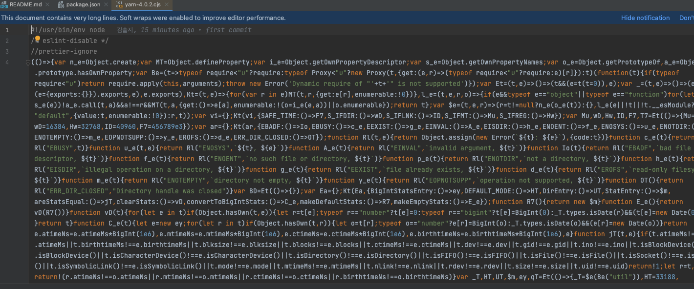
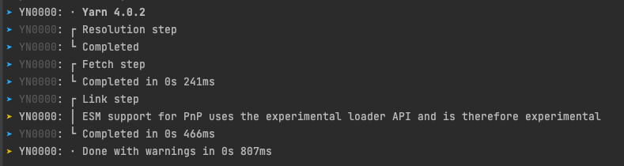

# 📝 2023년 12월 8일 기록
## Yarn berry 가 뭔데...
- `yarn berry` 를 극찬하는 게시글을 많이 봤기 때문에 이번에 만드려는 토이프로젝트에 `yarn berry`를 도입하고자 함.

### 도대체 왜 좋다고 하는 걸까?
- yarn berry 의 장점을 읽어봐도 도대체 이해가 가질 않음. (..주니어의 한계)
- 어떻게든 잘 정리해보려 한다.

yarn은 **버전에 따라** **yarn classic** 과 **yarn berry**로 나누어진다.

#### yarn classic
- yarn 1.x 버전
- 우리가 흔히 homebrew를 통해 설치해서 쓰는 형태
```shell
yarn add ...
yarn remove ... 
```

#### yarn berry
- **yarn 2.x버전 혹은 그 이상의 버전**
- yarn classic버전과 달리, 특정 프로젝트 환경에서 아래 명령어를 통해 berry 환경을 셋팅함.

```shell
yarn set version berry
```

- 그럼  `.yarn/release/yarn-3.2.3.cjs` 파일이 프로젝트 루트 경로에 생김.
- - yarn berry 환경을 구축하는 자바스크립트 파일. 모든 yarn의 동작이 수행됨.  
- 
- > ....그만알아보자

이후 장점은 프로젝트를 구성해나가면서 확인해봐야겠다.

yarn berry를 사용할 경우, 의존성 설치시..
- 와.. 빠르다!



**출처**
> https://helloinyong.tistory.com/343
> https://www.testbank.ai/b6cf538c-3e10-42a7-bc65-d2cb5805bcd6
