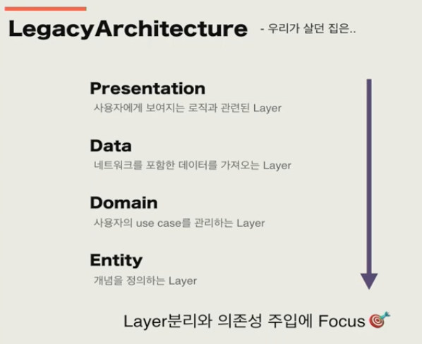
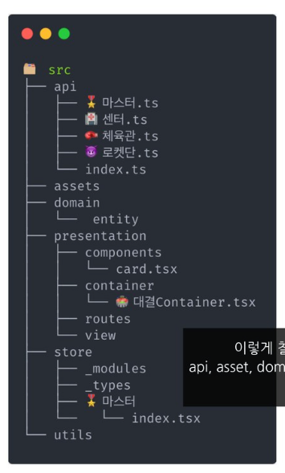
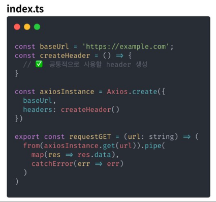
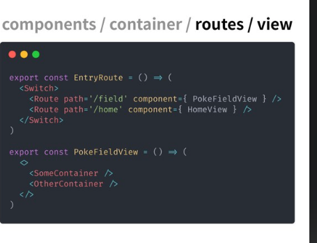

# 📝 2023년 12월 18일 기록
## 리액트 프로젝트 구조조정의 여정 (feat. 헌집줄게, 새집다오)
> 발표: https://www.youtube.com/watch?v=8mO-CuUkQRQ
> 슬라이드: https://speakerdeck.com/soyoung210/heonjibjulge-saejibdao-riaegteu-peurojegteu-gujojojeong

### 이전
🤔: 여러가지 서비스를 제공하는 하나의 프로젝트를 어떻게 구성할까
> 도메인(Domain) 중심으로 소프트 웨어를 설계하자!
>_(이때 도메인은 비즈니스 도메인을 의미함.)_

- 전체 구조를 4가지 레이어로 분리

### 왜 이사를 결심했나
- 기존에는 PC 서비스만 고려해서 프로젝트를 구성함.
- 하지만, 추후 웹뷰가 추가되면서 한 프로젝트에 웹뷰관련 기능이 추가
=> PC 서비스 + 앱서비스 !!??

### 현재 구조

- api
  - index
  - 

- presentaion
  - components
    - domain을 알지 못하는 재사용성을 최우선으로 고려하는 부분
  - comtainer
    - domain props를 가지는 부분 
  - router / view
    - 
