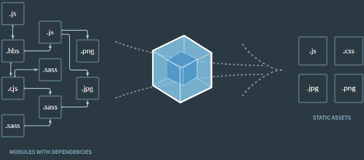

# 📝 2023년 12월 20일 기록
## Rollup.js
- `번들링`
    - 파일을 하나로 묶는 것 
    - 왜 하나로 묶어야 하나요?
      - HTTP 통신의 특성 때문
        - 단발성으로 리소스를 요청하는 HTTP 특성상, 요청할 파일이 많으면, 그만큼 여러먼 요청을 보내야 함.
        - 만약 파일을 하나로 묶어 한번만 요청할 수 있다면? -> `번들러` 의 탄생!

- `번들러`
  - 번들링을 해주는 녀석.
  - 대표적으로 Webpack이 있어요.
  - 
  - `.js` 파일을 읽어, 그 파일이 참조하고 있는 다른 여러 형식들의 파일들을 하나로 묶어 최종적으로 js,css,jpg,png 로 만든다는 과정을 설명한 그림.
  - 최초 진입점이 될 파일 1개를 선택한다는 것만 알자.

**[참고]**
> https://www.peterkimzz.com/rollupjs-lets-start-bundling
