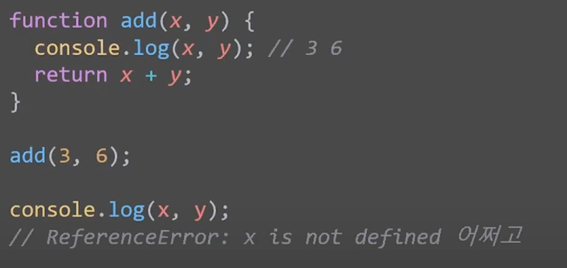
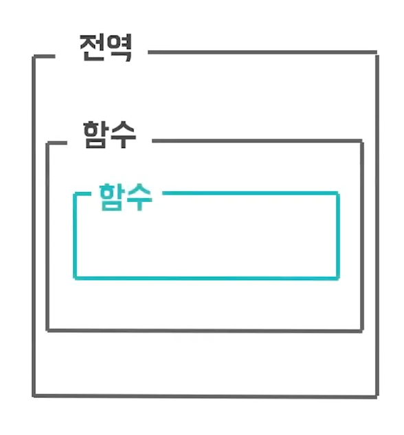
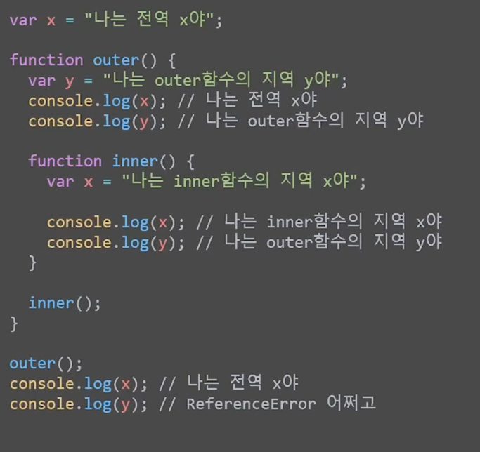
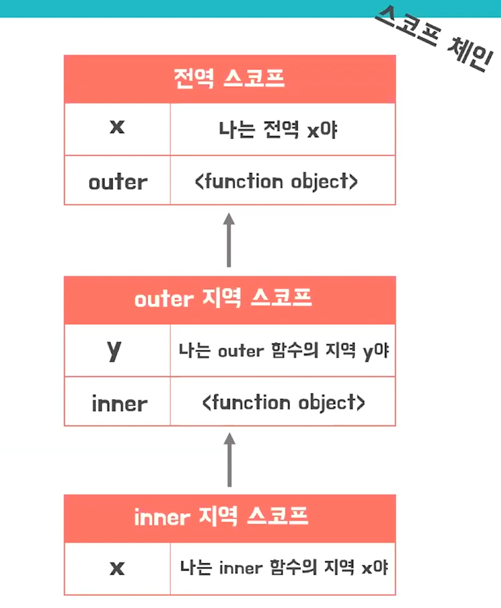

# 📝 2023년 12월 25일 기록
## 10분 데코톡 Scope & Closure

###함수의  Scope

- `x`, `y` 는 `add` 함수의 범위에 포함됨. 
- 이러한 유효범위를 **scope** 라 한다.

### Scope Chain

- 위 사진처럼 함수들이 중첩으로 이루어진 관계가 이루어질 수 있다.
- 함수 내부에 포함된 함수를 **중첩함수**라 함.

- 중첩함수는 자신을 호출하고있는 outer 함수의 지역변수에 접근할 수 있다.
- 이때 변수를 찾는 과정은 위로만 올라간다.
- 만약 전역 스코프에도 찾는 변수가 없으면 reference error 발생한다. 

이미 생명주기를 마감한 outer 함수 속 지역변수를 참조하고 있는 중첩함수를 클로져라 한다.

**[출처]**
> https://www.youtube.com/watch?v=PVYjfrgZhtU
