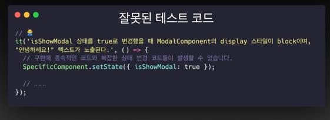
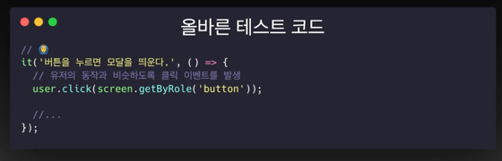
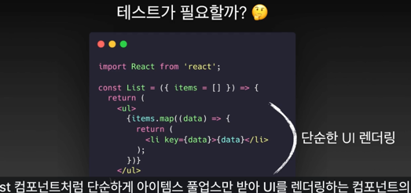
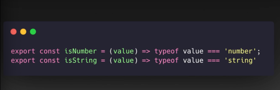
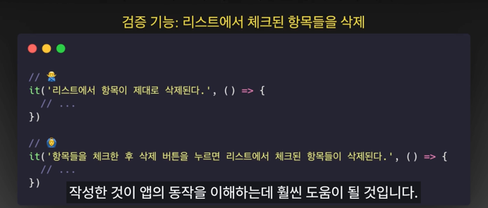
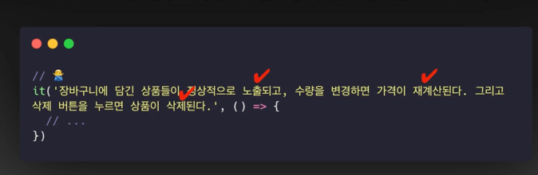

# 📝 2024년 01월 07일 기록
## 프런트엔드 테스트 공부 📚

-----
## 올바른 테스트 작성을 위한 규칙
### 1. 인터페이스 기준으로 테스트 작성

React 컴포넌트를 예로 들자면, 내부의 state 를 강제로 직접 변경하는 것이 아닌, 
컴포넌트와 통신할 수 있는 외부의 **인터페이스**를 통해 변경되는지 검증해야 함.

**(예시)**

> - 변경되는 상태가 많은 경우, 테스트코드 상에서 일일이 직접 변경해야 함.
> - 어떤 상황에서 변경되는 것인지 드러나지 않음.
> - 내부 상태나 변수값을 기준으로 검증하다 보니 어떤 것을 검증하는 지 파악하기 어려움.
> - 캡슐화를 위반!
>   - 상태나 변수명이 하나라도 바뀌면 테스트 코드 모두를 바꿔야함.
>   - `isShowModal` 이 바뀌면 다 바꿔줘야함.

**Dom Event Handler를 사용하자**

- 클릭 이벤트를 기반으로 동작하는지 확인하는 것
- 직접 상태 변경을 발생시키지 않아 종속성이 없다.
- 어떤 행위를 하는지 알 수 있다.

### 2. 의미있는 테스트인지 고민하자.
> 100% 커버리지를 위해 모든것을 테스트로 검증하려 하지 말자.

**커버리지**
- 테스트코드가 production code를 몇퍼센트 검증하고있는지 지표

> 단순히 UI를 렌더링 하는 컴포넌트 테스트가 의미가 있을까 ?
> - DOM 구조가 반복적으로 렌더링하는 컴포넌트를 검증하는 건 낭비이다.

> - 간단한 유틸함수는 버그가능성이 있을까?
> - 억지로 버그가능성을 만들지 않으면 버그가 발생하지 않음.
> - 간단한 연산을 처리하는 함수는 과감하게 테스트를 패스하자

**(정리)**
- 의미있는지
- 어떤 범위까지 검증해야 하는지

### 3. 가독성을 높이자!
- 테스트 하고자 하는 내용을 명확하게 적자

- 하나의 테스트에서는 하나의 동작만 검증하자. ->SRP 단일 책임 원칙

----

