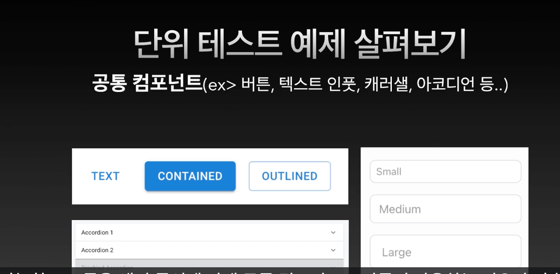
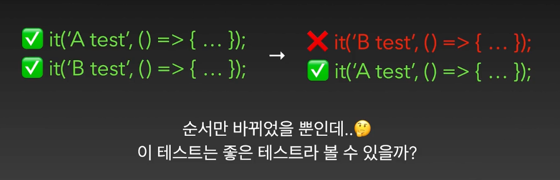
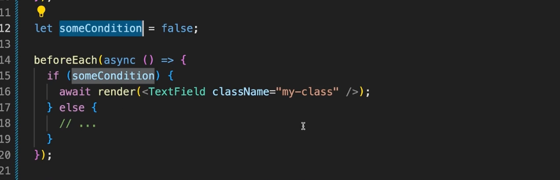

# 📝 2024년 01월 07일 기록
## 프런트엔드 테스트 공부 📚

-----
## 올바른 테스트 작성을 위한 규칙
### 1. 인터페이스 기준으로 테스트 작성

React 컴포넌트를 예로 들자면, 내부의 state 를 강제로 직접 변경하는 것이 아닌, 
컴포넌트와 통신할 수 있는 외부의 **인터페이스**를 통해 변경되는지 검증해야 함.

**(예시)**

> - 변경되는 상태가 많은 경우, 테스트코드 상에서 일일이 직접 변경해야 함.
> - 어떤 상황에서 변경되는 것인지 드러나지 않음.
> - 내부 상태나 변수값을 기준으로 검증하다 보니 어떤 것을 검증하는 지 파악하기 어려움.
> - 캡슐화를 위반!
>   - 상태나 변수명이 하나라도 바뀌면 테스트 코드 모두를 바꿔야함.
>   - `isShowModal` 이 바뀌면 다 바꿔줘야함.


**Dom Event Handler를 사용하자**

- 클릭 이벤트를 기반으로 동작하는지 확인하는 것
- 직접 상태 변경을 발생시키지 않아 종속성이 없다.
- 어떤 행위를 하는지 알 수 있다.

### 2. 의미있는 테스트인지 고민하자.
> 100% 커버리지를 위해 모든것을 테스트로 검증하려 하지 말자.

**커버리지**
- 테스트코드가 production code를 몇퍼센트 검증하고있는지 지표


> 단순히 UI를 렌더링 하는 컴포넌트 테스트가 의미가 있을까 ?
> - DOM 구조가 반복적으로 렌더링하는 컴포넌트를 검증하는 건 낭비이다.


> - 간단한 유틸함수는 버그가능성이 있을까?
> - 억지로 버그가능성을 만들지 않으면 버그가 발생하지 않음.
> - 간단한 연산을 처리하는 함수는 과감하게 테스트를 패스하자

**(정리)**
- 의미있는지
- 어떤 범위까지 검증해야 하는지

### 3. 가독성을 높이자!
- 테스트 하고자 하는 내용을 명확하게 적자


- 하나의 테스트에서는 하나의 동작만 검증하자. ->SRP 단일 책임 원칙


----
## 단위테스트 시작하기



> 단위테스트 검증하기 쉽다.
> 내부 비즈니스 로직에 의해 동작하는지 검증하면 됨.

**(따라하기)**
> AAA 패턴을 이용해 단위테스트를 작성해보자.

**AAA 패턴**
- `Arrange` - 테스트를 위한 환경 만들기
  - 예시: className 을 지닌 컴포넌트 렌더링
- `Act` - 테스트할 동작 발생
  -  렌더링에 대한 검증이기 때문에 생략
  -  클릭이나 메서드 호출, props 변경 등등에 대한 작업이 해당.
- `Assert` - 올바른 동작이 실행되었는지 검증
  -  렌더링 후 DOM에 해당 class가 존재하는지 검증!


**검증목표** : className props로 설정한 css class가 잘 적용 되는지

```javascript
// testing-library render함수를 호출하면,
// 테스트 환경의 jsDOM에 리엑트 컴포넌트가 렌더링된 DOM구조가 반영

await render(<TextField className="my-class" />); // Arrange

// className이란 내부 prop이나 state를 검증하지 않고
// 렌더링 되는 DOM구조가 올바르게 변경되었는지 확인(O) -> 최종적으로 사용자가 보는 결과는 DOM
expect(screen.getByPlaceholderText('텍스트를 입력해 주세요.')).toHaveClass(
    'my-class',
); // Assert
```

----
## 테스트 프레임워크
테스트 실행 및 검증에 필요한 환경을 제공하는 도구
일반적인 단위 통합 테스트를 위해 사용하는 테스트 프레임워크는 대부분
Node.js환경에서 구동됨.

### jsdom
- 브라우저와 다르게 Node.js 환경은 DOM이 존재하지 않는다.
- 프론트엔드 테스트시 DOM이 제대로 렌더링 되는지 확인하기 위한 환경이 필요하다.

Node.js환경에서는 브라우저를 직접 띄워 구동하기 어렵고 브라우저를 직접 구동한다고
하더라도 브라우저의 실행시간 테스트 실행시간이 오래걸림.

- 대부분 JSDOM환경을 사용해 실행.
브라우저 구현과는 분명히 다른부분이 존재
- 실제 UI 렌더링하여 볼 수 있는 구조는 아니다.

> `screen.debug()`

----
## 모든 테스트는 독립적으로 실행되어야 한다.

> 좋은 테스트라고 할 수 있을까?
> - 독립적 실행을 도와주는 도구
>   - setup teardown 을 사용
>   - setup: 테스트 실행 전
>   - teardown: 테스트 실행 후


**주의해야 할 점**

> 조건부로 호출하지는 말자.
