# 📝 2024년 01월 30일 기록

----
### 브라우저 렌더링 과정
1. `HTML` 정보를 브라우저 에서 가져옴.
2. 파싱 -> `DOM 노드 트리` 로 만듬
3. css 파일과 element inline 스타일을 파싱하고 스타일 정보를 추가하여 `Render Tree` 를 만듬
4. 레이아웃 과정
    -> 노드들은 좌표가 정해지고, 어느 곳에 위치해야 할 지 알게 됨.
5. 페인팅
6. UI 렌더

**-> DOM 조작 비효율성 발생!**

DOM을 조작할때마다 HTML CSS 파싱부터 페인팅 과정까지 전부 진행해야 함.

### Virtual DOM
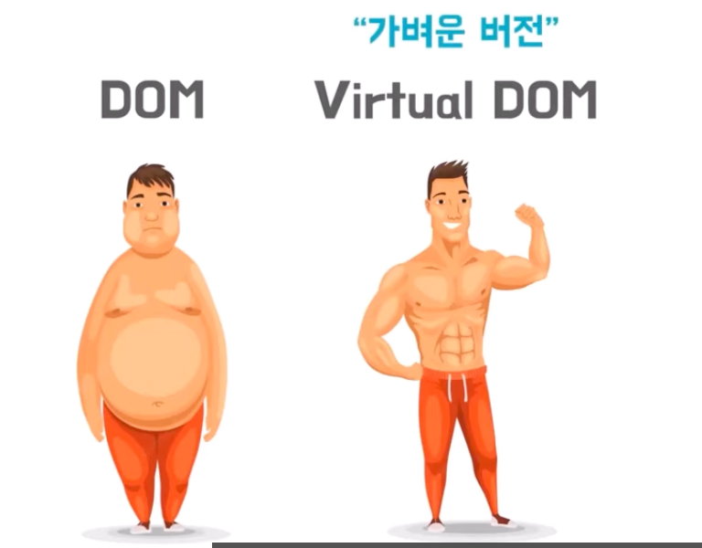

> - Dom node tree 복제한 자바스크립트 객체
> - element 속성은 갖지만, DOM api는 가지고 있지 않음.

**동작방식**
- dom tree -> virual dom tree 복사
- 변화가 생기면 새로운 가상 dom tree를 다시 만듬

> 렌더링 하지 않고 메모리 상에서 트리변경이라 빠름.

- diff함수에서 previos current로 변화된 부분을 확인함. 그리고 변경된 부분 적용
- 변화들을 버추얼 돔에  변경된 부분만 렌더링!

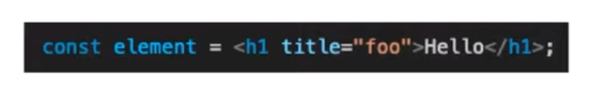
-> 바벨
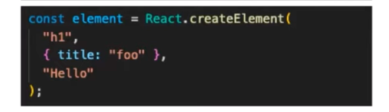
-> 자바스크립트 객체
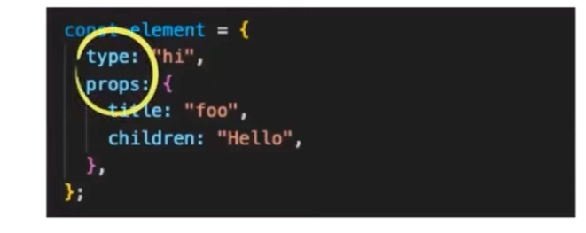
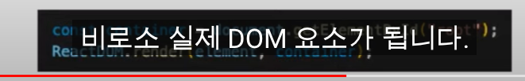

**재조정**
> 버추얼 돔과 실제 돔을 비교하고 일치시키는 과정

**diffing 알고리즘**
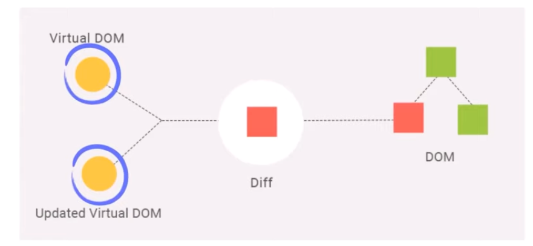

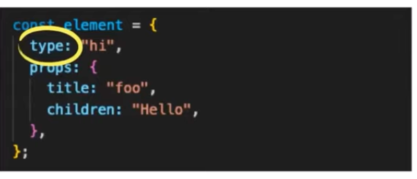
**타입이 같은경우**
- 동일한 내역은 유지 변경된 속성만 갱신

**타입이 달라진 경우**
- 이전 트리를 삭제하고 새로운 트리 생성

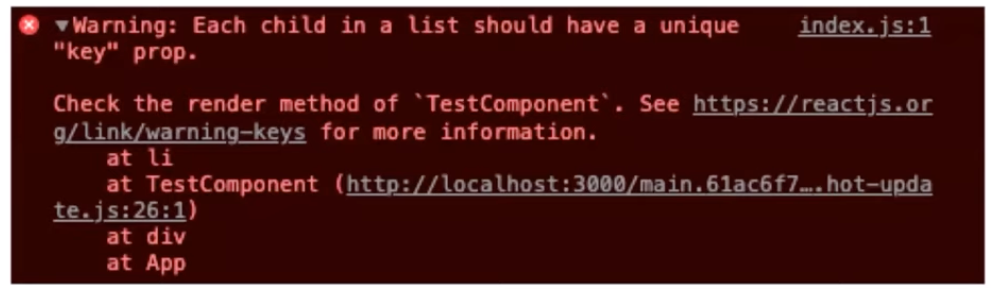
재조정과 깊은 연관이 있다.

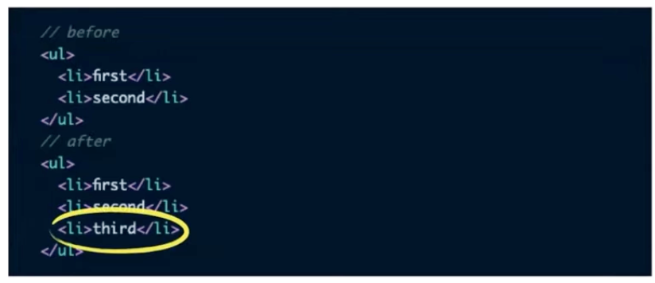
문제없음.

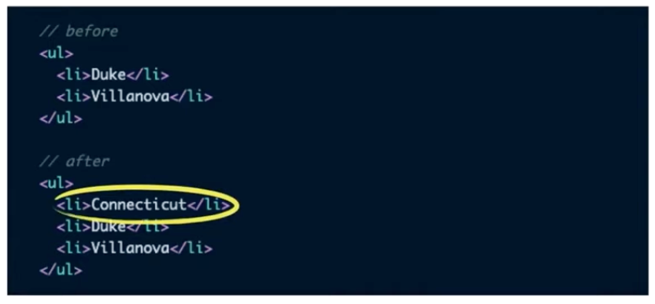
자식노드를 새로 그림.

Key props -> 식별자 재공

key값으로 이전트리와 변경 이후 트리를 비교
유일한 값을 넣어주자

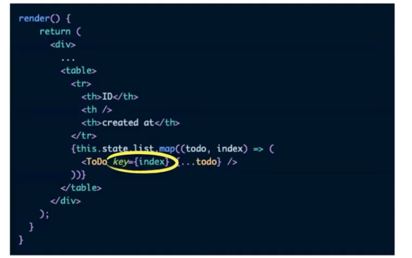
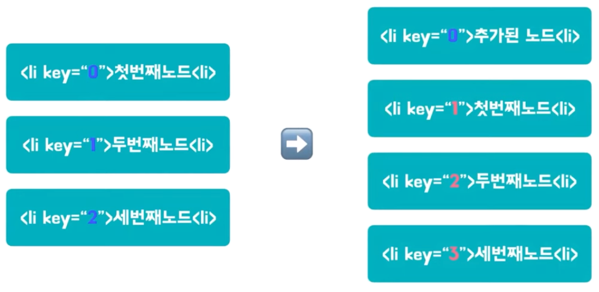

**출처**
> https://www.youtube.com/watch?v=6rDBqVHSbgM
> https://mingule.tistory.com/61

