# 📝 2024년 03월 12일 기록
## 토스ㅣSLASH 21 - 프론트엔드 웹 서비스에서 우아하게 비동기 처리하기

> 비동기 프로그래밍

좋은 사용자 경험을 위해 필수작업!

- 순서가 보장되지 않는 경우가 있기 때문에 구현이 어렵다.
  - 서버에 요청했는데 응답을 기다리다가 다른 유저 인터렉션에 반응하지 않는다면 멈춰있게 될 것.
  - 서버에 요청보내고 기다리는게 아니라 다른 작업을 하면서 응답을 처리해야 한다.

**왜 다루기 어려울까?**
### **좋은 코드란?**

 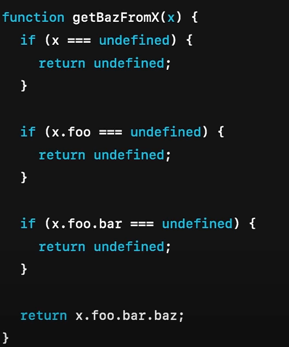

- 하는 일은 단순한데 비해서 코드가 너무 복잡하다.
- 각 프로퍼티에 접근하는 핵심 기능이 코드로 잘 드러나지 않는다.

- `x.foo.bar.baz` 프로퍼티에 안전하게 접근하는 일
- 함수가 하는일이 명확하게 드러나는 것이 아니라, 명령어의 성격이 많이 보임

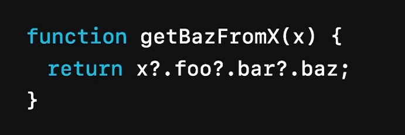
**왜 읽기 좋을까?**
- 코드가 간결하다
- 함수의 역할을 한눈에 파악할 수 있다.
- 성공한 경우를 생각하는 x.fooo.bar.baz와 문법적 차이가 크지 않다.

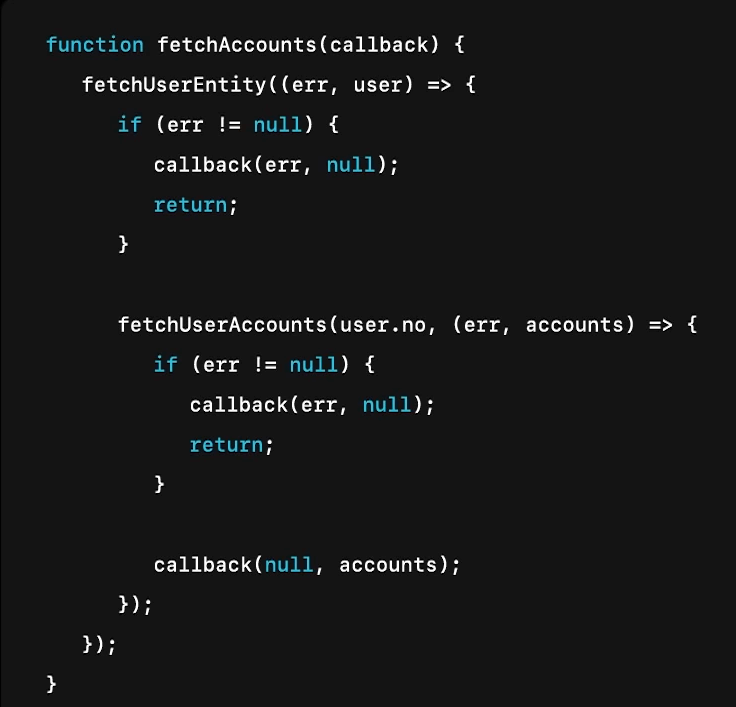
 
- 성공하는 경우와 실패하는 경우가 섞여서 처리됨
- 코드를 작성하는 입장에서 매번 에러 유무를 확인해야 한다. 비동기 호출을 할 때 마다.
- 함수가 하는 진짜 역할이 가려졌다.

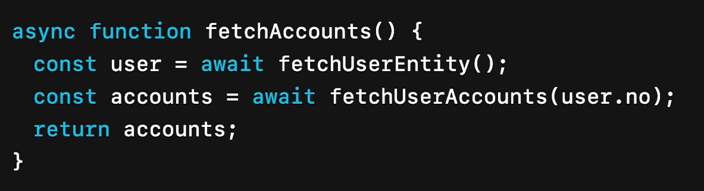
- 왜 좋은 코드라 말할 수 있을 까?
- 성공한 경우만 모아서 다룰 수 있다.
- 실패하는 경우는 catch절에서 분리해 처리한다.
- 실패하는 경우에 대한 처리를 외부에 위임할 수 있다.

**좋은코드의 특징**
- 성공, 실패의 경우 분리해 처리할 수 있다.
- 비즈니스 로직을 한눈에 파악할 수 있다.

API 호출을 처리할때 어떻게 처리했을까?
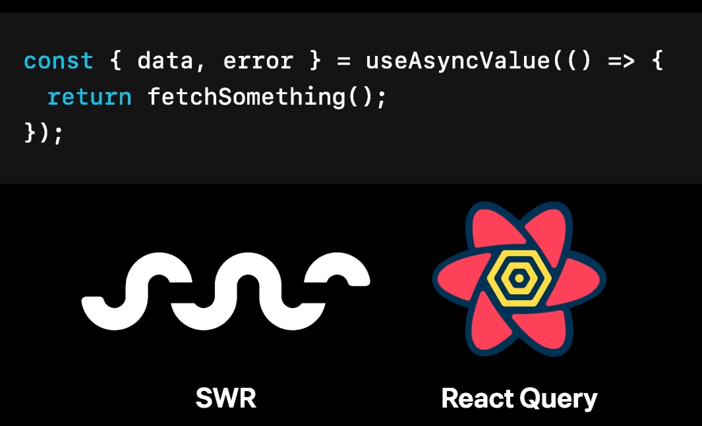
 Promise를 반환하는 함수를 React Hook인자로 넘기고
Promise의 상태변화에 따라 Hook이 반환하는 data, error의 값을 적절히 채워준다.

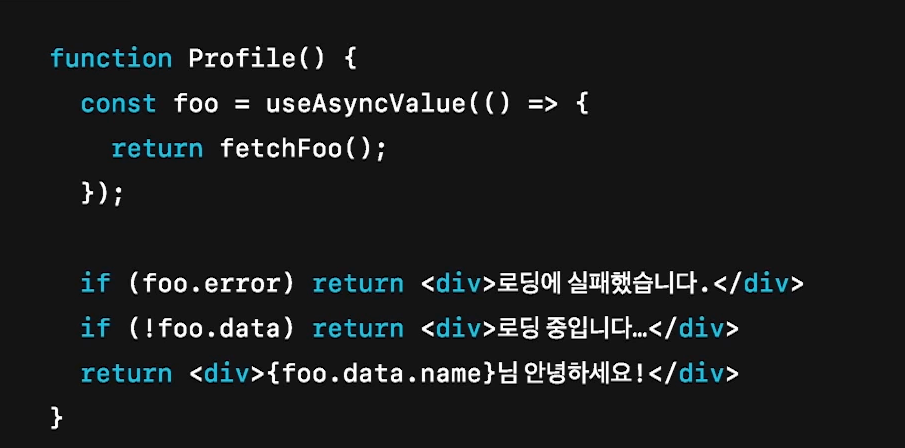
- 성공하는 경우와 실패하는 경우가 섞여서 처리된다.
- 실패하는 경우에 대한 처리를 외부에 위임하기 어렵다.

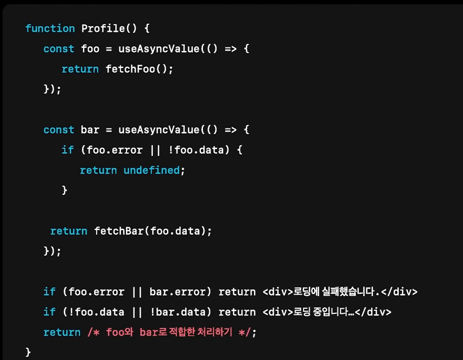
- bar를 가져오기 위해선 foo가 필요한 상황

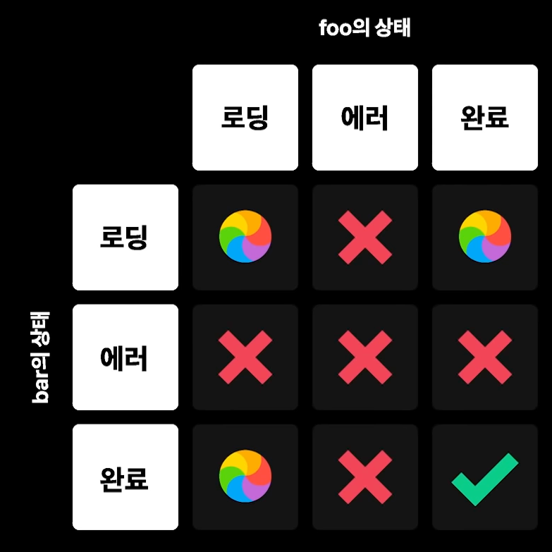
2개의 비동기 리소스를 가져온다면 3^3 9개의 상태가 생김

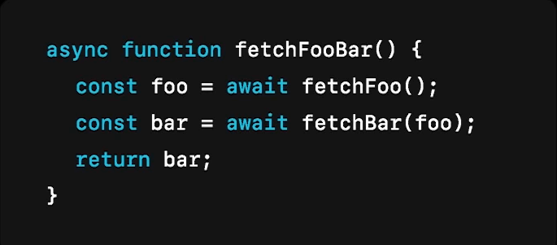
- 성공하는 경우에만 집중해 복잡도를 낮춘다.
- 일반적으로 작성하는 동기로직과 큰 차이가 없다.

React의 비동기 처리는 어렵다.

- 성공하는 경우에만 집중에 컴포넌트를 구성하기 어렵다.
- 2개 이상의 비동기 로직이 개입할 때 비즈니스 로직을 파악하기 어렵다.

## React Suspense for Data Fetching
데이터를 가져오기 위한 Suspense

- 컴포넌트는 성공한 상태만 다루고 로딩상태나 에러상태는 외부에게 위임

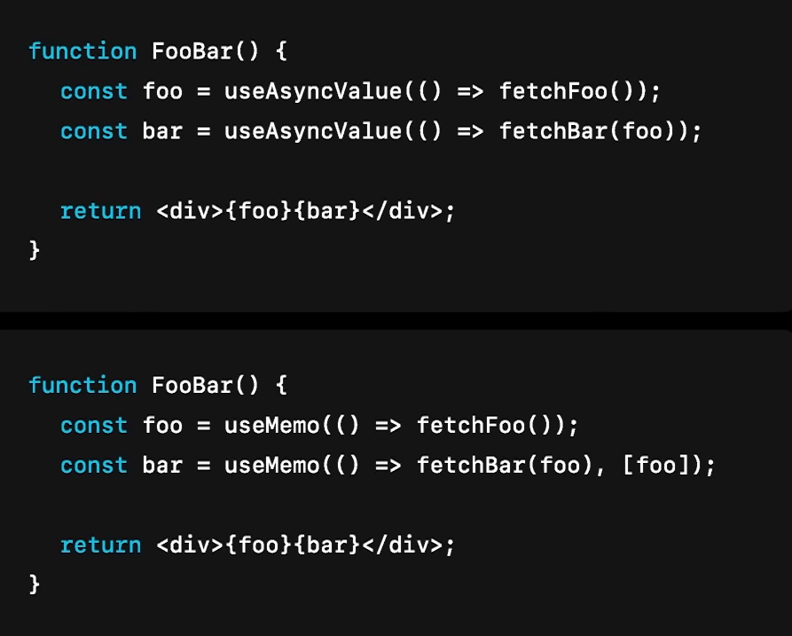

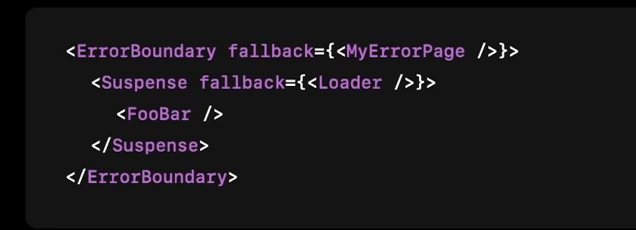

- 컴포넌트를 쓰는 쪽에서 로딩처리와 에러 처리를 한다
- 로딩상태는 가장 가까운 Suspense의 Fallback으로 그려진다.
- 에러는 ErrorBoundary Fallback으로 그린다.

거의 유사하다.

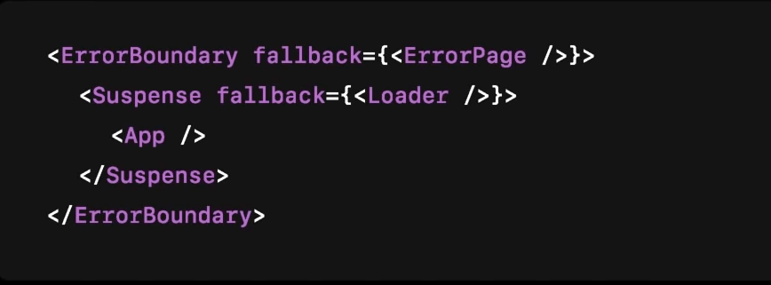

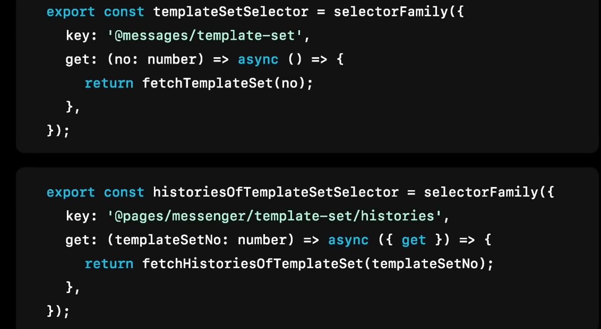
비동기 리소스를 selectorFamily 로 정의해서 리턴.
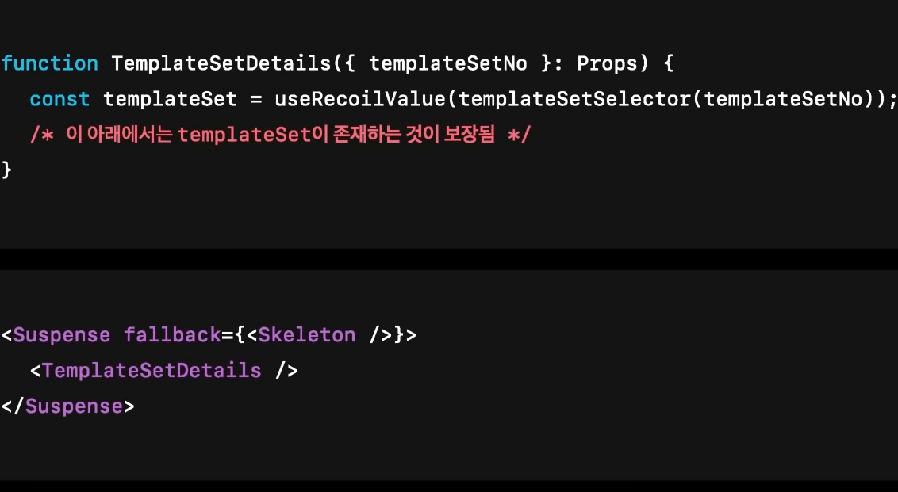
useRecoil로 가져오면 Suspense가 일어남.

어떤 코드 조각을 감싸는 맥락으로 책임을 분리하는 방식을 대수적 효과라고 한다

> https://www.youtube.com/watch?v=FvRtoViujGg
