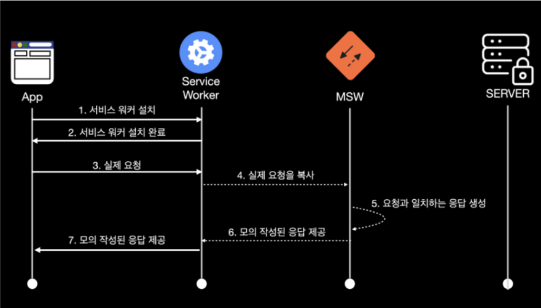

# MSW 기초
`Mocking Service Worker`
* 서비스 워커를 사용해 네트워크 호출을 가로채는 API 모킹(mocking)
* 백엔드 API인 척 하면서 프론트엔드의 요청에 가짜 데이터를 응답해준다.

## 동작원리

- 브라우저에 Service Worker 설치
- 브라우저에서 이루어지는 요청을 Service Worker가 가로챔

## 기본설정

### 설치
```shell
npm install msw --save-dev
or
yarn add msw --dev
```

### 파일 구성
`project root > mooks > handler.ts` 파일 생성
- handler.ts 는 모든 요청 핸들러를 가진다.

### Request handler
mocking할 API에 대한 method, path 그리고 mocking 할 response를 반환하는 함수를 정해주어야 한다.

- REST API 를 mocking 할 필수 항목을 import 한다.
``` typescript
// src/mocks/handlers.js
import { rest } from 'msw'
```

- 인터셉트할 api를 아래처럼 함수로 작성한다. 
```typescript
// src/mocks/handlers.js
import { rest } from 'msw'

export const handlers = [
  // Handles a POST /login request
  rest.post('/login', null),

  // Handles a GET /user request
  rest.get('/user', null),
]
```

### Response resolver

> req: 매칭 요청에 대한 정보
> res: mocked 응답을 생성하는 유틸리티 기능
> ctx: mocked 응답의 상태코드

```typescript
// src/mocks/handlers.js
import { rest } from "msw";

export const handlers = [
  // 첫번째 인자 : 요청경로
  // 두번째 인자 : response resolver 콜백 함수
  //    - req, res, ctx를 사용해 모의 응답을 작성한다.
	rest.post('/login', (req, res, ctx) => {
		sessionStorage.setItem('is-authenticated', 'true);
		return res(
			ctx.status(200)
		)
	}
	
	rest.get('/user', (req, res, ctx) => {
		const isAuth = sessionStorage.getItem('is-authenticated');
		if(!isAuth){
			return res(
				ctx.status(403),
				ctx.json({
					errorMessage : "Not Authorized",
				})	
			)	
		}	
		return res(
			ctx.status(200),
			ctx.json({
				usename: 'admin',
			})
		)
	
	})
] 
```

### Browser setup
브라우저에 사용하기 위해선 MSW를 서비스 워커에 등록하는 과정이 필요하다.
```shell
 npx msw init public/ --save
```
서비스워커 등록을 위한 파일이 `public` 폴더에 추가된다.
public폴더는 주로 프로젝트의 정적 리소스를 담는 폴더인데, CRA, Next,js, Vite에서 기본적으로 셋팅되어 있다.
다른 프로젝트일 경우에는 설정이 다를 수 있으니 [이곳](https://mswjs.io/docs/getting-started/integrate/browser#where-is-my-public-directory) 을 참고하자.


global.d.ts
```typescript
import { SetupWorker, rest } from 'msw'

declare global {
  interface Window {
    msw: { worker: SetupWorker; rest: typeof rest }
  }
}

```

broswer.ts
```typescript
import { setupWorker, rest } from 'msw'
import handlers from './handler'

export const worker = setupWorker(...handlers)

window.msw = { worker, rest }

```