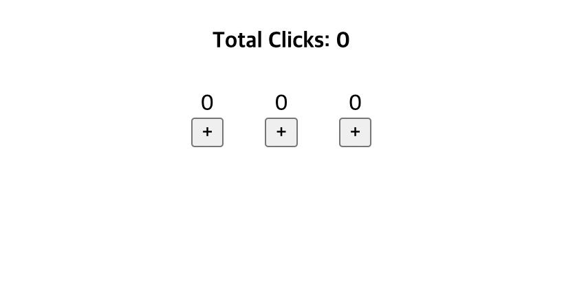
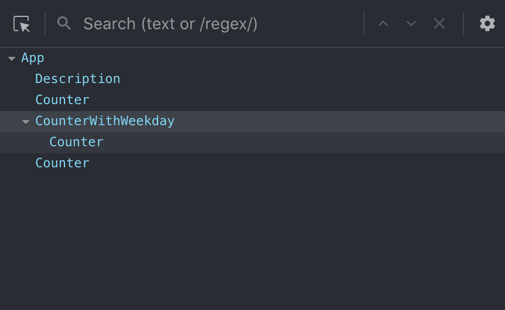
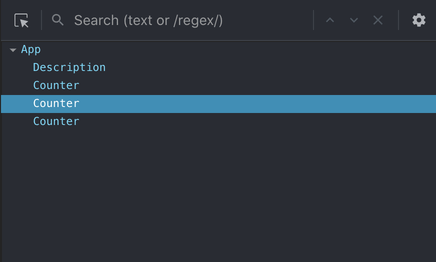

# `<Component />` ≠ `Component()`


컴포넌트를 만드려면 JSX 를 반환하도록 하자.

## 정리
기능이 있는 컴포넌트는 컴포넌트 내부가 아닌 외부에 작성하자
```typescript
const Users = ()=>  <UserList pattern={search}/>;

return (
    <div id="app" className="home-page">
      <Header />
      <WelcomeSlogan/>
      <Users/> // No
      <UserList pattern={search}/> // YES
    </div>
  );
```
    내부에 선언하게 되면 컴포넌트 내의 상태가 변할 때 마다 재렌더링이 일어나기 때문이다.


## 예제 1

```typescript
const App = () => {
const [search, setSearch] = useState('');

const Users = ()=>  <UserList pattern={search}/>;

return (
    <div id="app" className="home-page">
      <Header />
      <WelcomeSlogan/>
      <Users/>
    </div>
  );
}
```

여기서 `<User/>` 구성요소는 `search` 이 업데이트 될 때 마다 재렌더링이 야기된다.

- 컴포넌트에서는 `status` 가 변경될 때 마다 전체 함수 본문 이 다시 실행된다. 
- 즉, `status` 인 `search` 가 업데이트 될 때 마다, 본문이 다시 실행되고, JSX로 호출하고 있는 `<User/>` 도 다시 그려진다는 것이다.


#### GOOD
```typescript
 <UserList pattern={search}/>
```

* 컴포넌트안에 기능적 컴포넌트를 선언하지 말자.

-----

## 예시2

아래와 같이, 사용자가 버튼을 누르면, 버튼을 누른 만큼 카운트를 하는 App이 있다고 해보자. 




```typescript
const App = () => {
  const [total, setTotal] = useState(0);
  const incrementTotal = () => setTotal(currentTotal => currentTotal + 1);

  return (
    <div className="App">
      <div>
        <h4>Total Clicks: {total}</h4>
      </div>
      <div className="CountersContainer">
        <Counter onClick={incrementTotal} />
        <Counter onClick={incrementTotal} />
        <Counter onClick={incrementTotal} />
      </div>
    </div>
  );
};
```


이 App에 간단한 설명글을 추가해본다고 해보자.


```typescript
const App = () => {
  const [total, setTotal] = useState(0);
  const incrementTotal = () => setTotal((currentTotal) => currentTotal + 1);
  // 추가
+ const Description = () => (
+   <p>
+     I like coding counters!
+     Sum of all counters is now {total}
+   </p>
+ );

  return (
    <div className="App">
      <div>
        <h4>Total Clicks: {total}</h4>
        // 추가
+       <Description />
      </div>
      <div className="CountersContainer">
        <Counter onClick={incrementTotal} />
        <Counter onClick={incrementTotal} />
        <Counter onClick={incrementTotal} />
      </div>
    </div>
  );
};
```

이 코드는 이전처럼 잘 동작한다.
return 문 내부에 JSX를 직접 작성하는 대신, `<Description/>` 만 별도로 선언한 점만 다르다.


여기서 기능 하나만 더 추가해보자.

```typescript
+ const CounterWithWeekday = (props) => {
+   let today;
+   switch (new Date().getDay()) {
+     case 0:
+     case 6:
+       today = "a weekend!";
+       break;
+     case 1:
+       today = "Monday";
+       break;
+     case 2:
+       today = "Tuesday";
+       break;
+     default:
+       today = "some day close to a weekend!";
+       break;
+   }
+
+   return (
+     <div>
+       <Counter {...props} />
+       <br />
+       <span>Today is {today}</span>
+     </div>
+   );
+ };


return (
  ...
        <div className="CountersContainer">
        <Counter onClick={incrementTotal} />
-       <Counter onClick={incrementTotal} />
+       <CounterWithWeekday onClick={incrementTotal} />
        <Counter onClick={incrementTotal} />
      </div>
)
```

해당 코드를 실행하면 버그가 발생한다 !

새로 추가한 `CounterWithWeekday` 를 클릭하면 total clicks는 늘어가지만 카운트는 늘어나지 않는다.

아래처럼 바꾸거나,

```
-       <CounterWithWeekday onClick={incrementTotal} />
+       { CounterWithWeekday({ onClick: incrementTotal }) }
```

혹은 외부에 선언하면 버그가 사라진다.

### Thinking
- 근데 `<Description/>` 은 왜 버그가 일어나지 않나요?
- 왜 직접 함수로 호출하면 `CounterWithWeekday` 버그는 해결되나요?
- 두가지의 차이는 무엇인가요?

## 직접호출
- 우리가 만드는 대부분의 컴포넌트는 JSX를 리턴하는 일반 함수라는 것을 알 수 있다.
- 왜 우리는 직접 호출하지 않고, 구문을 사용해 호출하는 걸까요?
   - `function()` 로 호출하지 않고 `<function/>` 을 사용하는 이유


#### 1. `<CounterWithWeekday onClick={incrementTotal} />` 로 호출할 경우



#### 2. `{ CounterWithWeekday({ onClick: incrementTotal }) }` 로 호출할 경우



`CounterWithWeekday` 구성요소가 보이지 않는다.
- 왜냐면, 단지 함수 호출일 뿐이이며, 구성요소가 아니기 때문이다.

```typescript
const HelloWorld = () => {
  const text = () => 'Hello, World';

  return (
    <h2>{text()}</h2>
  );
}
```

`text` 변수가 구성요소가 아니며 단순히 함수호출임을 알 수 있다.

- <Component />를 사용하면 구성 요소를 React에 표시되도록 만든다.
- 그러나 `text` 는 예제에서 직접 호출되었기 때문에 React는 그 존재를 결코 알 수 없다.


단계별로 일어나는 일은 다음과 같다.

1. `CounterWithWeekday` 내부에 선언되어 App구성 요소로 사용됩니다.
2. 처음에는 렌더링됩니다.
3. 업데이트 할 때마다 App새로운 항목이 `CounterWithWeekday` 생성됩니다.
4. `CounterWithWeekday` 는 업데이트되지 않고 항상 처음부터 마운트됩니다.
5. 그럼 하위 자식인 `Counter` 도 각 업데이트마다 다시 생성되므로 각 App상위 업데이트 이후의 상태는 항상 0입니다.


#### 출처
> https://dev.to/igor_bykov/react-calling-functional-components-as-functions-1d3l