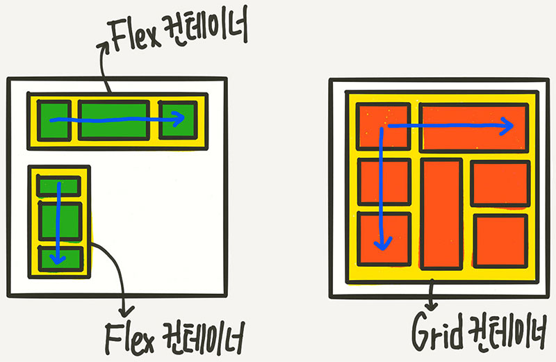

## Grid와 친해지기

### Flex와 Grid의 차이점
* `flex`
  * 한방향 레이아웃 시스템 (1차원)

* `Grid`
  * 두방향 (가로와 세로) 레이아웃 시스템 (2차원)



따라서 `grid` 는 더 복잡한 레이아웃 표현이 가능하다.

### 시작하기

```html
<div class="container">
	<div class="item">A</div>
	<div class="item">B</div>
	<div class="item">C</div>
	<div class="item">D</div>
	<div class="item">E</div>
	<div class="item">F</div>
	<div class="item">G</div>
	<div class="item">H</div>
	<div class="item">I</div>
</div>
```


부모요소인 `div.container` 를 **Grid Container**
자식요소인 `div.item` 을 **Grid Item** 이라 부른다.

 첫 시작은, 부모 컨테이너에 grid display 설정을 주는 것이다.
```css
.container {
	display: grid;
}
```

### 그리드 형태 정의

```css
.container {
	grid-template-columns: 200px 200px 500px;
	/* grid-template-columns: 1fr 1fr 1fr */
	/* grid-template-columns: repeat(3, 1fr) */
	/* grid-template-columns: 200px 1fr */
	/* grid-template-columns: 100px 200px auto */

	grid-template-rows: 200px 200px 500px;
	/* grid-template-rows: 1fr 1fr 1fr */
	/* grid-template-rows: repeat(3, 1fr) */
	/* grid-template-rows: 200px 1fr */
	/* grid-template-rows: 100px 200px auto */
}
```

* `grid-template-rows` 행의 배치
* `grid-template-columns` 는 열의 배치

이때 `1fr` 은 1 비율로 균등하게 나누겠다는 단위이다.


> **참고자료**
> 
>*  https://studiomeal.com/archives/533