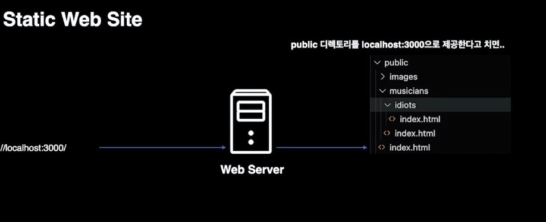
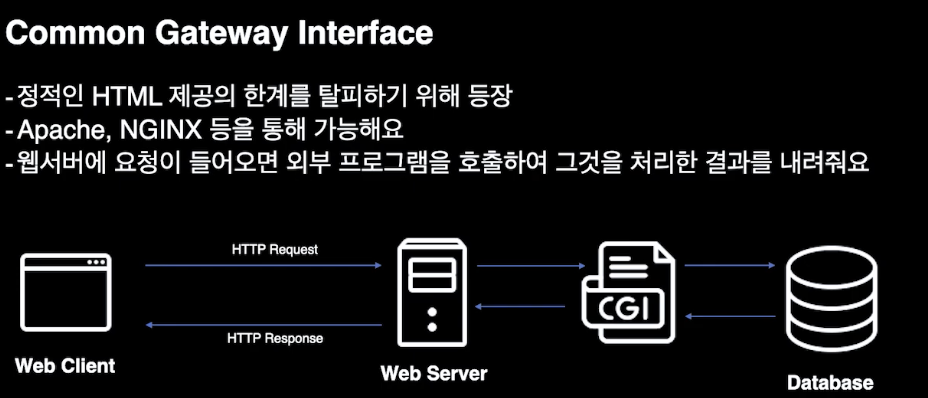
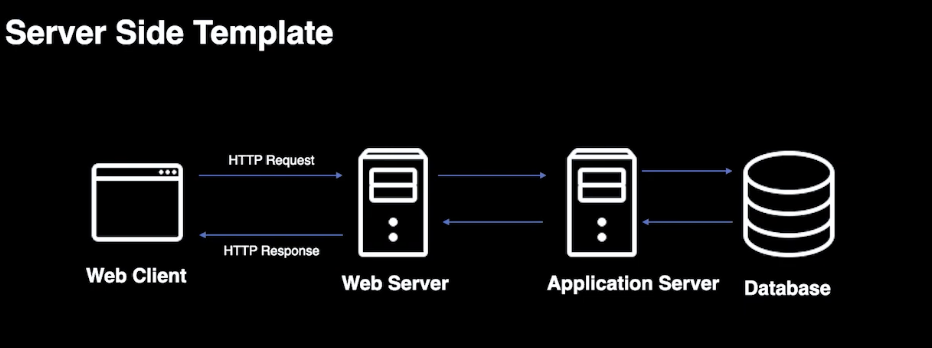
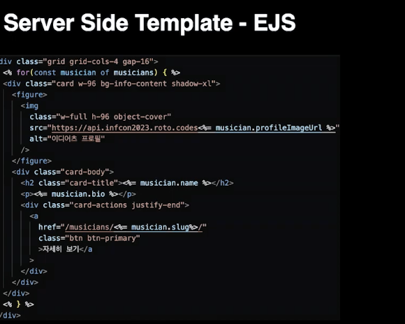
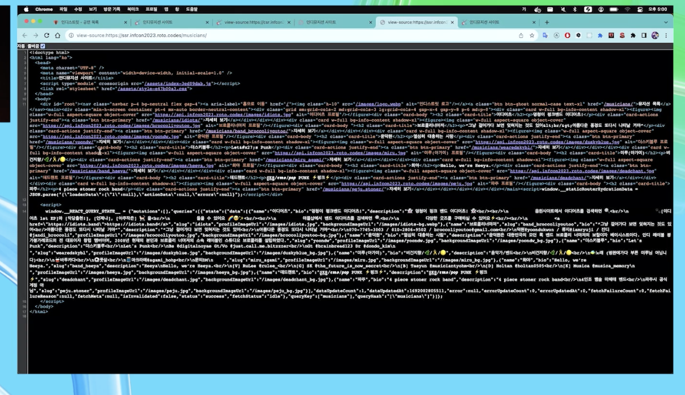

# SSR의 기쁨과 슬픔: 렌더링의 변화의 흐름을 통해 알아보는 SSR과 Streaming SSR

## 렌더링의 변천사를 아는 것이 중요하다

### static web site
- 정적인 html 파일 중심으로 제공
- 디렉토리의 파일 **주소**가 곧 주소가 된다.

단점
- 정적인 화면은 데이터베이스에 데이터를 불러와 그려준다거나 API를 호출해 동적으로 화면을 그려내는 것이 불가능.

### CGI

웹서버에 요청이 들어오면, 외부 프로그램을 호출해서 그것을 처리한 결과를 내려줌.
- 정적인 문제를 해결하려고 나왔다!

### SST
- Server Side Template
- Server application이 조건과 로직에 따라 HTML을 내려줌

CIG랑 다른점
- 웹서버가 없어도 됨.
-  자바, 파이썬, 루비
하나의 언어에서도 굉장히 다양한 Template 이 존재한다.

단점
- html생성만 함.
- 인터렉션 처리 등은 javascript는 별도로 client에서 처리를 해야함.

종류가 굉장히 많다.
JSP, Thymeleaf, EJS...

표현식에 맞는 데이터를 넣으면, 그에 맞는 데이터가 노출된다.

문제점
- UI가 단순했던 시절엔 충분.
- 지금은 복잡한 경우가 너무 많음.
- 이후의 기능을 자바스크립트를 이용해 처리하는 것이 많음
- 같은 뷰 로직이 서버사이드에서도 클라이언트에서 구현되어야 함.

더보기/api호출해서 동적으로 그려주어야 할 때, 자바스크립트로 구현해야 할 것. -> 더보기 기능이나 무한스크롤

서버는 고쳤는데 클라이언트가 안고쳐지고... 반대도 ..

렌더링 시점이 뒤섞이면서 복잡한 인터렉션의 UI를 다룰수록 작업자의 고통은 커진다.

서버에서 api 호출, db query시간이 느려지면 사용자에게 보여지는 화면이 느려짐.

### CSR
- 이건 브라우저 성능이 발전함에 따라 추가
- 자바스크립트 스펙 고도화
- 아예 렌더링을 클라이언트에서 해버리자!
- api는 떨어져있고(분리), 웹 애플리케이션은 html, css, js만 있는 형태

뷰 로직은 모두 클라이언트에만
서버에선 api형태로!

- 개념적으로는 static web site와 거의 같다.
- 별도의 웹서버가 없어 CDN을 통한 배포를 한다.
- 서버를 관리할 일이 없어지니 부담이 적어짐.

CDN이라고 하는게 트래픽이 몰려도 인프라레벨에서 처리해줌.
클아이언트를 만들었는데 -> 엄청 몰림 -> 트래픽이 몰린다고해서 -> 클라이언트입장에서 스케일아웃하거나 할 필요 X (단 UI 처리는 해야겠죠? / 백엔드는 죽어나감)

### SPA
- 배포한 다음 새로고침하면 404 에러?
- cdn은 그 경로에 있는 Index.html을 부르려고 할 거임.
- 404 > root에 있는 Index.html로 돌림. 

화면을 불러온 다음에 api를 호출하기 때문에, api를 불러도 사용자에게 로딩중이라는 것을 알려줄 수 있음.

문제점
- 고정된 index.html 을 가지고 있음
- 어느 페이지를 접속해도 매번 같은 index.html을 내려주기 때문에 meta:og 태그 관련 문제가 발생한다.

- 어느 요청을 해도 같은 index.html 을 내려주기 때문에 이후 클라이언트에서 모두 맡기기 때문.

- 크롤러/봇 입장에선 클라이언트에서 화면을 만들기 전 html 만 받아올 수 있음.

성능 문제
- 초기에는 body 가 텅 비어있다가 자바스크립트가 그려주는 형식
- 초기에 실행해야 하는 js 양이 많아질 수 밖에 없다.
- 체감 속도가 생각보다 느리게 느껴질 수 있음.

메모리 누수에 좀 더 취약하다.
- spa는 새로고침을 하는게 아니라
- 화면이 이동을 하면 js를 새로 그리는 로직.

SSR
-> 서버에서 화면을 그리면 되는거 아니냐?

렌더링의 책임을 서버로 돌린다.

같은 언어를 서버와 클라이언트에서 쓸 수 있다.

거으ㅢ 모든 뷰 로직을 크라이언트와 서버에서 공유할 수 있다.

텅 비어있다.

서버에서 렌더링

문제가 있다.
더이상 서버리스가 아니기 때문에, 서버 관리 책임이 생긴다.

관리할 서버가 있기 때문에, 트래픽이 몰릴 경우 작업이 필요하다.

빌드 및 배포시간이 CSR 대비해서 더 늘어난다.

세팅이 복잡하다.
- next.js, remix 가 나오면서 많이 희석된 단점.
- 간단하다는 것의 이면을 보면, 복잡한 것을 얘네가 하고있다는 것.
- 문제가 생겼을 때 잘못쓰고 인지, 인프라문제인지, 서버문제인지 알 수 없다.
- 결론적으로는 CSR 경험만 있던 사람들에게는 개념이 복잡하게 느껴질 수 있다.

렌더링에 대한 차이점을 알아야 더 잘 이해할 수 있다.
왜해야하는지, 어떤 장점을 얻을 수 있는지, 어떤 리스크를 감당해야 하는지. 알 수 있다.

어떤식으로 렌더링 전략을 가져갔는지.

당근마켓 동네생활

동네 커뮤니티 기능
웹뷰를 다양한 서비스에서 활용하고 있음.
대부분의 서비스가 React 기반 서버사이드렌더링

배포는 PAAS (vercel, cloudfront)

초기에 로딩하는 걸리는 시간이 생각보다 오래 걸린다.
-> 초기에 필요한 자원을 받고 실행하는데 걸리는 시간.

배포직후에는 JS Bundle 이나 CSS등을 새로 받아야 하는데, 생각보다 로딩에 시간이 걸린다.

사용자 경험
화면을 최대한 빨리 뜨게 하는 것에 대한 고민

구현하고 보니...
react-query
suspense 를 통해 로딩처리
ReactDom.renderToString 은 지원하지 않음.
SSR 이 완전하게 되지 않았다.

렌더링을 클라에게 맡긴다.
suspense 하는 구간을 만나면 CSR 로 전환이 되었다..

api처리만 prefetch 처리만 먼저

이정도만 해줘도 빠르다.

그럼에도 불구하고
초기 렌더링 속도가 확연하게 빨라졌다

SSR 의 슬픔이 시작되고..

인프라 관리와 서버 운영에 대해 너무나도 신경을 많이 써야 한다.

